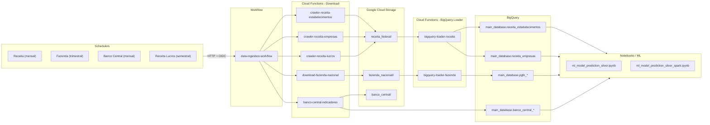

# 🏗️ Arquitetura do Sistema de Ingestão

## 📊 Visão Geral da Arquitetura



```
┌─────────────────────────────────────────────────────────────────────┐
│                       Cloud Scheduler                                │
│  ┌───────────────┐ ┌───────────────┐ ┌───────────────┐             │
│  │  Mensal (5º)  │ │ Mensal (10º)  │ │ Trimestral    │  ...        │
│  │ Banco Central │ │    Receita    │ │    Fazenda    │             │
│  └───────┬───────┘ └───────┬───────┘ └───────┬───────┘             │
└──────────┼─────────────────┼─────────────────┼─────────────────────┘
           │                 │                 │
           │ HTTP POST       │ HTTP POST       │ HTTP POST
           │ (JSON Payload)  │ (JSON Payload)  │ (JSON Payload)
           ▼                 ▼                 ▼
┌─────────────────────────────────────────────────────────────────────┐
│                         GCP Workflow                                 │
│                   data-ingestion-workflow                            │
│                                                                      │
│  ┌────────────────────────────────────────────────────────────┐    │
│  │ 1. Recebe tipo de execução (type: mensal/trimestral/etc)  │    │
│  │ 2. Executa branch correto                                  │    │
│  │ 3. Trata erros e retries                                   │    │
│  │ 4. Faz logging de todas operações                          │    │
│  │ 5. Retorna resultado consolidado                           │    │
│  └────────────────────────────────────────────────────────────┘    │
│                                                                      │
│  Branches disponíveis:                                              │
│  ├─ receita_mensal       (Estabelecimentos + Empresas)             │
│  ├─ receita_lucros_anual (Regime Tributário)                       │
│  ├─ fazenda_trimestral   (PGFN)                                    │
│  ├─ banco_central        (Indicadores Econômicos)                  │
│  └─ full                 (Todas em paralelo)                        │
└──────┬───────────┬───────────┬───────────┬──────────────────────────┘
       │           │           │           │
       │ OIDC Auth │ OIDC Auth │ OIDC Auth │ OIDC Auth
       ▼           ▼           ▼           ▼
┌──────────┐ ┌──────────┐ ┌──────────┐ ┌─────────────┐
│   CF 1   │ │   CF 2   │ │   CF 3   │ │    CF 4     │
│ Receita  │ │ Receita  │ │ Fazenda  │ │   Banco     │
│  Estab.  │ │ Empresas │ │ Nacional │ │   Central   │
└────┬─────┘ └────┬─────┘ └────┬─────┘ └──────┬──────┘
     │            │            │               │
     │ Download   │ Download   │ Download      │ API Calls
     │ + Extract  │ + Extract  │ + Extract     │ + Process
     ▼            ▼            ▼               ▼
┌─────────────────────────────────────────────────────────┐
│              Google Cloud Storage                        │
│                gs://dados-cnpjs/                         │
│                                                          │
│  ├─ receita_federal/                                     │
│  │   ├─ estabelecimentos/                               │
│  │   │   └─ 2024-11/                                    │
│  │   │       └─ *.csv                                   │
│  │   ├─ empresas/                                       │
│  │   │   └─ 2024-11/                                    │
│  │   │       └─ *.csv                                   │
│  │   └─ regime_tributario/                              │
│  │       └─ *.csv                                       │
│  │                                                       │
│  └─ fazenda_nacional/                                    │
│      └─ 2024/                                           │
│          └─ 3trimestre/                                 │
│              ├─ Nao_Previdenciario/*.csv                │
│              ├─ FGTS/*.csv                              │
│              └─ Previdenciario/*.csv                    │
└──────────────────────────────────────────────────────────┘
                        │
                        │ Load Data
                        ▼
        ┌───────────────────────────────┐
        │        BigQuery               │
        │  main_database.tabelas        │
        │                               │
        │  ├─ banco_central_bronze      │
        │  └─ banco_central_silver      │
        └───────────────────────────────┘
```

---

## 🔄 Fluxo de Execução Detalhado

### 1️⃣ Agendamento (Cloud Scheduler)

```
Cloud Scheduler → HTTP POST Request → Workflow Execution
                     (OIDC Auth)
                     
Payload exemplo:
{
  "argument": "{\"type\": \"receita_mensal\"}"
}
```

**Agendamentos:**
- **Dia 5** (02:00): Banco Central
- **Dia 10** (02:00): Receita Federal (Estabelecimentos + Empresas)
- **Dia 15** (02:00): Fazenda Nacional (apenas Jan, Abr, Jul, Out)
- **15 Fev** (02:00): Receita Lucros (apenas Fevereiro)

---

### 2️⃣ Workflow Orchestration

```
┌─────────────────────────────────────┐
│   Workflow: data-ingestion-workflow │
└─────────────────────────────────────┘
           │
           ├─ Step 1: Init (variáveis)
           ├─ Step 2: Log Start
           ├─ Step 3: Select Branch (switch)
           │
           ├─ Branch: receita_mensal
           │    ├─ Call: crawler-receita-estabelecimentos
           │    ├─ Call: crawler-receita-empresas
           │    └─ Return: results
           │
           ├─ Branch: fazenda_trimestral
           │    ├─ Call: download-fazenda-nacional
           │    └─ Return: results
           │
           ├─ Branch: banco_central
           │    ├─ Call: banco-central-indicadores
           │    └─ Return: results
           │
           └─ Branch: full (parallel execution)
                ├─ Call ALL functions in parallel
                └─ Return: consolidated results
```

**Tratamento de Erros:**
- Try/Catch em cada chamada de Cloud Function
- Logs detalhados de erros
- Continuação mesmo com falhas parciais
- Retry automático via Cloud Functions

---

### 3️⃣ Cloud Functions Execution

Cada Cloud Function:

```
1. Recebe trigger via Pub/Sub
2. Valida parâmetros de entrada
3. Faz download dos dados (HTTP)
4. Processa em memória (extract ZIP)
5. Upload direto para GCS
6. Limpa recursos temporários
7. Retorna status e estatísticas
```

**Características:**
- ✅ **Timeout:** 540s (9 minutos)
- ✅ **Memory:** 2Gi (processamento de ZIPs grandes)
- ✅ **Max Instances:** 1 (evita paralelismo excessivo)
- ✅ **Runtime:** Python 3.11
- ✅ **Gen2:** Execução em Cloud Run

---

### 4️⃣ Data Storage (GCS)

**Estratégia de Armazenamento:**
```
gs://dados-cnpjs/
├─ <fonte>/           # Nome da fonte (receita_federal, fazenda_nacional)
│  └─ <periodo>/      # Período (YYYY-MM, YYYY/Qtrimestre)
│     ├─ *.csv        # Dados extraídos
│     └─ .markers     # Marcadores de processamento
```

**Marcadores:**
- `.{filename}.extracted` - Indica que arquivo já foi processado
- Previne reprocessamento desnecessário
- Permite retry seguro

---

## 🔐 Segurança e Permissões

### Service Account Principal

```
{PROJECT_ID}@appspot.gserviceaccount.com
```

**Roles necessárias:**
- `roles/workflows.invoker` - Invocar workflows
- `roles/cloudfunctions.invoker` - Invocar Cloud Functions
- `roles/storage.objectAdmin` - Ler/escrever no GCS
- `roles/bigquery.dataEditor` - Inserir dados no BigQuery

### Autenticação

```
Cloud Scheduler → Workflow: OIDC Token
Workflow → Cloud Functions: OIDC Token
Cloud Functions → GCS: Service Account Key (automatic)
Cloud Functions → BigQuery: Service Account Key (automatic)
```

---

## 📊 Dados Processados

| Fonte | Formato | Volume Aprox. | Frequência |
|-------|---------|---------------|------------|
| **Receita Estabelecimentos** | CSV (ZIP) | 2-5 GB | Mensal |
| **Receita Empresas** | CSV (ZIP) | 500 MB - 1 GB | Mensal |
| **Receita Lucros** | CSV (ZIP) | 100-500 MB | Anual |
| **Fazenda Nacional** | CSV (ZIP) | 500 MB - 2 GB | Trimestral |
| **Banco Central** | JSON (API) | 1-5 MB | Mensal |

---

## 🔍 Monitoramento e Logs

### Cloud Logging

**Logs disponíveis:**
```
- Cloud Scheduler executions
- Workflow executions
- Cloud Functions logs
- Error traces
```

**Filtros úteis:**
```bash
# Todos os erros
resource.type=workflows.googleapis.com/Workflow AND severity=ERROR

# Execuções de um workflow específico
resource.labels.workflow_id=data-ingestion-workflow

# Logs de uma Cloud Function
resource.type=cloud_function AND resource.labels.function_name=crawler-receita-estabelecimentos
```

### Cloud Monitoring

**Métricas úteis:**
- Workflow execution time
- Workflow success/failure rate
- Cloud Function invocations
- Cloud Function execution time
- GCS storage usage
- BigQuery job statistics

---

## 💰 Estimativa de Custos

### Cloud Functions (Gen2)
```
- Invocações: ~30/mês
- Tempo execução: ~270 minutos/mês total
- Custo estimado: $2-5/mês
```

### Cloud Storage
```
- Armazenamento: ~50-100 GB
- Operações: ~1000/mês
- Custo estimado: $1-2/mês
```

### Workflows
```
- Execuções: ~30/mês
- Steps: ~200/mês
- Custo estimado: <$1/mês
```

### Cloud Scheduler
```
- Jobs: 4-5
- Custo estimado: $0.20-0.50/mês
```

### BigQuery
```
- Storage: ~10-50 GB
- Queries: Variável
- Custo estimado: $1-5/mês
```

**Total Estimado: $5-15/mês**

---

## 🔄 Ciclo de Vida dos Dados

```
1. COLETA (Cloud Functions)
   ├─ Download de fontes externas
   ├─ Validação básica
   └─ Armazenamento em GCS (bronze layer)

2. PROCESSAMENTO (Future: Dataflow/Dataproc)
   ├─ Limpeza de dados
   ├─ Transformações
   ├─ Enriquecimento
   └─ Armazenamento processado (silver layer)

3. AGREGAÇÃO (Future: BigQuery Views)
   ├─ Joins entre fontes
   ├─ Agregações
   └─ Views materializadas (gold layer)

4. CONSUMO (Notebooks/BI Tools)
   ├─ Análises
   ├─ Dashboards
   └─ ML Models
```

---

## 🚀 Escalabilidade

### Vertical Scaling
- Aumentar memory/CPU das Cloud Functions
- Aumentar timeout para arquivos maiores

### Horizontal Scaling
- Aumentar max_instances (paralelismo)
- Sharding de dados por período
- Processamento em lote (batch)

### Otimizações
- Cache de dados já processados (marcadores)
- Compressão de dados no GCS
- Particionamento no BigQuery
- Materialized views

---

## 📚 Referências

- [GCP Workflows Documentation](https://cloud.google.com/workflows/docs)
- [Cloud Functions Gen2](https://cloud.google.com/functions/docs/2nd-gen)
- [Cloud Scheduler](https://cloud.google.com/scheduler/docs)
- [Cloud Storage](https://cloud.google.com/storage/docs)
- [BigQuery](https://cloud.google.com/bigquery/docs)

---

**Última atualização:** Novembro 2025

